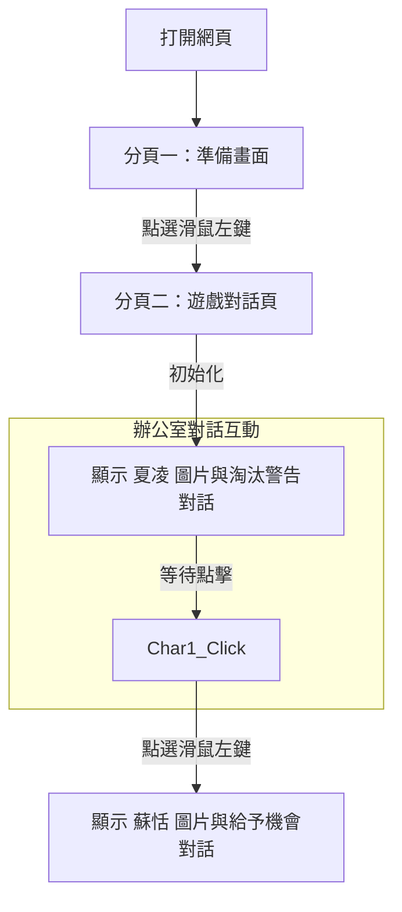

這是一份根據您調整後的**生活化職場主線——【拯救爆肝地獄！新人的部門改造計畫】**所修正的**軟體規格設計說明書（SDD）**。

架構同樣保持最精簡的 MVP 模式，專注於處理雙分頁、雙角色與生活化對話的切換邏輯。

---

# 《化形之後》期末專案軟體規格設計說明書 (SDD)

## 專案主題：拯救爆肝地獄！新人的部門改造計畫

## 1. 系統概述

本專案為《化形之後》線上職場劇本殺遊戲的最小可行性原型（MVP）。前端採用 HTML、CSS 與 JavaScript 進行網頁端視覺呈現，後端核心對話生成採用 LangChain 框架驅動。

本階段的核心目標為引導玩家進入一個「充斥惡劣加班文化」的業務部門，並透過網頁左鍵點擊，動態切換「冷酷 HR 主管（夏凌）」與「改革派總經理（蘇恬）」的對話與圖片，開啟玩家解決職場痛點的冒險。

---

## 2. 系統架構與流程

### 2. 1 畫面流轉圖

以下為前端網頁畫面的切換邏輯。連線標籤已配合 Notion 格式調整為純文字（不含括號、斜線或特殊字元）：



---

## 3. 介面設計 (UI Design)

### 3. 1 畫面結構與佈局

網頁共分為兩個主要檢視狀態（透過 CSS `display: none/block` 控制切換）：

* **分頁一（遊戲準備首頁）：**
* **互動：** 畫面任意處點選「滑鼠左鍵」，即切換至分頁二。


* **分頁二（辦公室對話頁）：**
* **背景圖層（CSS Background）：** 固定載入 `背景圖.png`（呈現辦公室場景）。
* **角色圖片區（Img Tag）：** 位於畫面正中央，根據對話進度動態更換 `角色一.png`（夏凌）或 `角色二.png`（蘇恬）。
* **底部對話框（Dialogue Box）：** 固定於畫面底部，包含「角色名稱欄」與「生活化對話內容顯示欄」。


### 3. 2 UI 視覺佈局示意圖

```
+-------------------------------------------------------+
|                                                       |
|                 【 背景圖.png (辦公室) 】               |
|                                                       |
|                 +-------------------+                 |
|                 |                   |                 |
|                 |   角色圖片顯示區   |                 |
|                 | (角色一/角色二.png) |                 |
|                 |                   |                 |
|                 +-------------------+                 |
+-------------------------------------------------------+
| [夏凌 / 蘇恬]                                          |
| 這裡顯示 LangChain 生成的職場痛點對話...                 |
+-------------------------------------------------------+

```

---

## 4. 資料與角色設定（LangChain Prompt 基礎）

### 4. 1 角色設定資料表

為了讓 LangChain 能精準生成符合「爆肝地獄」主題的對話，後端鎖定以下精簡設定：

| 角色編號 | 角色名稱 | 前端對應圖片 | 職場生活化身分

 | 核心性格與立場

 |
| --- | --- | --- | --- | --- |
| **角色一** | **夏凌** | `角色一.png` | 總公司派來的 HR 實習稽核主管

 | **KPI 機器：** 說話講求數據與邏輯，認為瘋狂加班和內鬥是提升產值的方法，極度冷酷。

 |
| **角色二** | **蘇恬** | `角色二.png` | 剛上任的空降總經理

 | **高層改革派：** 優雅有威嚴，想打破爆肝加班文化，正在尋找有勇氣的新人打破局勢。

 |

### 4. 2 靜態 Demo 對話資料（API 預設回傳）

```json
[
  {
    "role": "夏凌",
    "image": "角色一.png",
    "text": "總經理，這個新人昨天的加班時數不達標。根據 HR 的不適任淘汰規律，我建議今天就讓他捲鋪蓋走人，這對公司才是最有效率的選擇。"
  },
  {
    "role": "蘇恬",
    "image": "角色二.png",
    "text": "夏凌，你那套冰冷的 KPI 數據該適可而止了。如果一個部門只剩下瘋狂加班和內鬥，那公司離倒閉也不遠了。這位新人，我想聽聽你的想法，你打算怎麼解決你目前的處境？"
  }
]

```

---

## 5. 動態行為流程演算法

當使用者在網頁上點選**滑鼠左鍵**時，前端 JavaScript 執行以下邏輯：

```
如果 (目前畫面狀態 == 分頁一) {
    1. 隱藏分頁一，顯示分頁二介面
    2. 將網頁背景更換為 "背景圖.png"
    3. 讀取對話陣列第 0 筆資料
    4. 將角色名稱欄設為 "夏凌"，圖片更換為 "角色一.png"，對話文字更換為夏凌的淘汰警告
    5. 將目前畫面狀態更新為 分頁二
    6. 將目前對話索引值設為 1
} 否則如果 (目前畫面狀態 == 分頁二 且 對話索引值 == 1) {
    1. 讀取對話陣列第 1 筆資料
    2. 將角色名稱欄設為 "蘇恬"，圖片更換為 "角色二.png"，對話文字更換為蘇恬的改革詢問
    3. 將目前對話索引值設為 2 (對話結束，等待後續 LangChain 玩家輸入功能擴充)
}

```